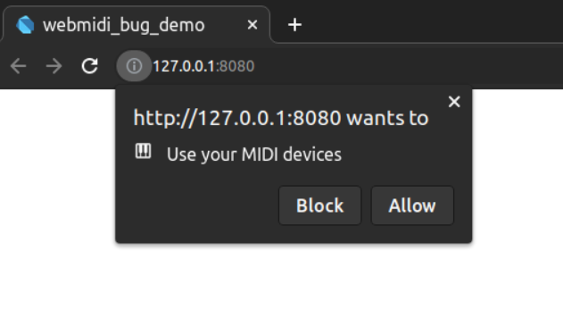
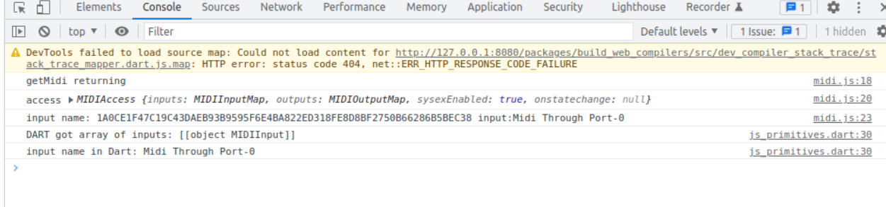

# Minimal demonstration of bug in Dart web for JS "maplikes"

[The bug in question.](https://github.com/dart-lang/sdk/issues/33248)

## Usage

Run using:

```
webdev serve --debug
```

When the page loads for the first time Chrome should prompt you with a dialog requesting permission for the page to use Midi:



note: if this was not running on `localhost`, **HTTPS** would be mandatory to allow webmidi usage.

You will need to open Chrome devtools to see console output. For the successful (bug workaround) case you should see:
